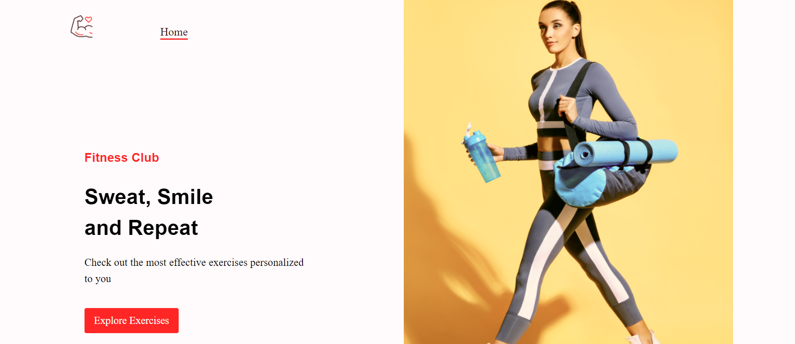

# Fitness Exercise Project

Fitness Exercise Project is build using:
- React.js.
- Material UI
- Rapid API

## Live website

[Fitness Exercise App](https://fitness-exercise-app-nu.vercel.app/)

## Project Info
- Project is build using Reactjs, React-router-dom.
- Material UI, an open-source React component library is used in this project.
- Rapid API is used for API integration and API.

## Preview

